# TRAINEX: Enterprise Production Architecture & Engineering Plan (v1.0 Production Standard)

**Authors:** Google Principal Technical Evangelist & Google DeepMind Multimodal Architects  
**Target Environment:** Google Cloud Platform (Enterprise Production Tier)  
**Classification:** Google Cloud & Alphabet Confidential / Enterprise Partner Grade  
**Workspace:** `/Users/nitinagga/Documents/trainex`

---

## Executive Production Blueprint

This document defines the complete, battle-tested, carrier-grade **Production Architecture and Engineering Plan** to take Trainex from architecture specifications to a globally distributed, resilient cloud platform on Google Cloud.

```
┌──────────────────────────────────────────────────────────────────────────────────────────────────┐
│                                 PRODUCTION ARCHITECTURE TOPOLOGY                                 │
│                                                                                                  │
│  [ Enterprise Client / LMS / WebApp ]                                                           │
│                  │ (HTTPS / TLS 1.3 via Cloud Armor WAF)                                         │
│                  ▼                                                                               │
│  ┌─────────────────────────────────┐                                                            │
│  │   Cloud Load Balancer (Global)  │                                                            │
│  └───────┬─────────────────┬───────┘                                                            │
│          │                 │                                                                    │
│          ▼                 ▼                                                                    │
│   ┌─────────────┐   ┌─────────────┐                                                             │
│   │ Studio API  │   │ WebRTC Live │ (Gemini Multimodal Live Proxy Gateway)                       │
│   │  (FastAPI)  │   │ Proxy (WSS) │                                                             │
│   └──────┬──────┘   └──────┬──────┘                                                             │
│          │                 │                                                                    │
│          ▼                 ▼                                                                    │
│   ┌───────────────────────────────┐     ┌────────────────────────┐                              │
│   │ Cloud Tasks & Event Queues    │ ──► │ Firestore State DB     │                              │
│   └──────────────┬────────────────┘     └────────────────────────┘                              │
│                  │                                                                              │
│    ┌─────────────┼───────────────┐                                                              │
│    ▼             ▼               ▼                                                              │
│ ┌─────────────┐ ┌─────────────┐ ┌─────────────┐  (VPC Connector + Cloud NAT)                    │
│ │ Authoring   │ │ CDP Replay  │ │ Studio GPU  │  (Static Enterprise Egress IP Pool)             │
│ │ Cloud Run   │ │ Cloud Run   │ │ Cloud Run   │  (NVIDIA L4 24GB Accelerator)                   │
│ └──────┬──────┘ └──────┬──────┘ └──────┬──────┘                                                 │
│        │               │               │                                                        │
│        └───────────────┼───────────────┘                                                        │
│                        ▼                                                                        │
│         ┌─────────────────────────────┐                                                         │
│         │ Google Cloud Storage (GCS)  │ (CMEK Encrypted, Multi-Regional)                         │
│         │   - gs://trainex-vault      │                                                         │
│         │   - gs://trainex-media-raw  │                                                         │
│         │   - gs://trainex-media-prod │                                                         │
│         └──────────────┬──────────────┘                                                         │
│                        │                                                                        │
│                        ▼                                                                        │
│         ┌─────────────────────────────┐                                                         │
│         │ Cloud CDN & HLS Streaming   │ ──► Signed 4K Enterprise Video Stream                    │
│         └─────────────────────────────┘                                                         │
└──────────────────────────────────────────────────────────────────────────────────────────────────┘
```

---

## 1. Enterprise Production Infrastructure on Google Cloud

### 1.1 Networking & Zero-Trust Perimeter
* **Global External Application Load Balancer:** Fronts all user-facing HTTP and WebSocket traffic with Google-managed SSL certificates and TLS 1.3 termination.
* **Cloud Armor Security Policy:**
  - Enforces IP rate limiting (100 req/min per IP on API routes).
  - Web Application Firewall (WAF) rules inspecting SQLi, XSS, and payload anomalies.
  - Geo-fencing capabilities for regional compliance (EU GDPR / US GovCloud).
* **Virtual Private Cloud (VPC) & Cloud NAT:**
  - Dedicated VPC (`trainex-prod-vpc`) with zero public IPs on backend compute workers.
  - **Serverless VPC Access Connector:** Connects Cloud Run services directly to private VPC subnets.
  - **Cloud NAT + Cloud Router:** Outbound traffic from the CDP replay workers egresses through a dedicated pool of **static enterprise IP addresses** registered with Google Identity as trusted corporate automation addresses.

### 1.2 Compute Fleet (Cloud Run Microservices)

| Service Name | Compute Type | Container Base | Hardware Resources | Concurrency | Autoscaling |
| :--- | :--- | :--- | :--- | :--- | :--- |
| `trainex-api` | Cloud Run Service | Python 3.12 (FastAPI) | 2 vCPU, 4GB RAM | 80 | 1–50 instances |
| `trainex-webrtc-proxy` | Cloud Run Service | Node.js 22 (WebSocket) | 4 vCPU, 8GB RAM | 40 | 1–30 instances |
| `trainex-author-agent` | Cloud Run Job | Node.js 22 + Chromium | 4 vCPU, 16GB RAM | 1 (Isolated) | 0–10 jobs |
| `trainex-cdp-runner` | Cloud Run Job | Ubuntu 24.04 + Chrome Shell | 8 vCPU, 32GB RAM | 1 (Isolated) | 0–20 jobs |
| `trainex-gpu-render` | Cloud Run Job | Ubuntu 24.04 + FFmpeg GPU | 16 vCPU, 64GB, NVIDIA L4 (24GB) | 1 (Isolated) | 0–8 GPU jobs |

### 1.3 Persistence & Storage Tier
* **Google Cloud Storage (GCS):**
  - `gs://trainex-session-vault`: Stores KMS-encrypted Chrome profile archives (`profile.tar.gz`). Bucket has Object Versioning and strict Uniform Bucket-Level Access (UBLA).
  - `gs://trainex-media-staging`: Ephemeral screencasts, raw audio tracks, and Remotion frame caches (Auto-deleted after 7 days via GCS Lifecycle Rules).
  - `gs://trainex-media-deliverables`: Master 4K MP4s, HLS segmented directories (`.m3u8`, `.ts`), and VTT subtitle tracks. Multi-region redundancy.
* **Firestore in Native Mode:**
  - Stores course generation state machines, Segment Manifests, Step Traces, and millisecond Telemetry streams with sub-millisecond query latency.

---

## 2. Security, Identity & Compliance Matrix

### 2.1 Workload Identity Federation (No Static Service Account Keys)
* **Zero Service Account Keys:** No service account JSON key files ever exist on disk or in repository commits.
* **Runtime IAM Impersonation:**
  - The Cloud Run service account (`trainex-runner-sa@...`) possesses strictly the `roles/iam.serviceAccountTokenCreator` permission.
  - When accessing demo sandbox projects, it calls Google Cloud IAM's `generateAccessToken` API to mint short-lived (15-minute) in-memory OAuth tokens.

```
┌─────────────────────────┐                                 ┌─────────────────────────┐
│ Cloud Run Runner SA     │ ───► IAM Token Creator API ───► │ 15-Minute OAuth Token   │
│ (No local key files)    │                                 │ (Stored only in RAM)    │
└─────────────────────────┘                                 └────────────┬────────────┘
                                                                         │
                                                                         ▼
                                                            [ Touches Demo Project ]
```

### 2.2 Chrome Session Vault Lifecycle & KMS Envelope Encryption
1. **Interactive Seeding (Day 0):** A certified Google Trainer logs into the training Google Account once via an authenticated bastion inside the VPC.
2. **KMS Encryption:** The resulting `user-data-dir` directory is compressed into an uncompressed tar stream, encrypted using Google Cloud KMS (`projects/.../cryptoKeys/trainex-session-key`), and written to `gs://trainex-session-vault`.
3. **Container Boot Unpack:**
   - The Cloud Run replay container requests decryption from Cloud KMS using its identity token.
   - The archive is unpacked directly into an in-memory `tmpfs` (RAM filesystem) mount at `/dev/shm/chrome-profile`.
   - **Crucial Security Rule:** The session files never write to persistent physical disk. When the container terminates, the memory is instantly reclaimed.
4. **Automated Keepalive Probe:** A Cloud Scheduler cron runs every 48 hours to ping `console.cloud.google.com`. If an auth challenge is detected, it alerts the on-call engineer via PagerDuty.

### 2.3 Automated Enterprise PII & NDA Sanitization Pipeline
Every frame captured by the CDP runner passes through an automated three-tier redaction pipeline before video mastering:
1. **Deterministic Bounding Box Masking:** Telemetry logs from the runner identify the exact `{x, y, w, h}` of sensitive elements (billing accounts, user avatar) and apply a Gaussian blur shader ($\sigma = 24\text{px}$).
2. **OCR Anomaly Scrubber:** Tesseract / OpenCV scans every 15th frame for text matching sensitive regular expressions:
   - Billing Account: `\b01[0-9A-Z]{4}-[0-9A-Z]{6}-[0-9A-Z]{6}\b`
   - Corporate Email: `[a-zA-Z0-9._%+-]+@google\.com`
   - Internal Project Prefix: `\bcorp-[a-z0-9-]+\b`
3. **Fail-Closed Audit Gate:** If any unmasked match is detected with confidence $>0.85$, the segment build is aborted, and a remediation ticket is logged.

---

## 3. End-to-End Production Lifecycle State Machine

```mermaid
stateDiagram-v2
    [*] --> DRAFT
    DRAFT --> PLANNING : User Prompt + Specs Submitted
    
    state PLANNING {
        [*] --> GENERATING_SYLLABUS
        GENERATING_SYLLABUS --> COMPILING_MANIFEST
        COMPILING_MANIFEST --> VALIDATING_DURATIONS
    }
    
    PLANNING --> AUTHORING : Manifest Approved by Human/Supervisor
    
    state AUTHORING {
        [*] --> PROVISIONING_SANDBOX
        PROVISIONING_SANDBOX --> FLASH_CUA_DOM_EXPLORATION
        FLASH_CUA_DOM_EXPLORATION --> EMITTING_TRACE
    }
    
    AUTHORING --> REHEARSING : Trace Emitted
    
    state REHEARSING {
        [*] --> RUN_1
        RUN_1 --> RUN_2 : Pass
        RUN_2 --> RUN_3 : Pass
        RUN_1 --> FLAKE_HEALER : Flake / Fail
        RUN_2 --> FLAKE_HEALER : Flake / Fail
        RUN_3 --> FLAKE_HEALER : Flake / Fail
        FLAKE_HEALER --> RUN_1 : Selector Re-anchored
    }
    
    REHEARSING --> RECORDING : 3/3 Runs Pass Cleanly
    
    state RECORDING {
        [*] --> RESTORE_AUTH_PROFILE
        RESTORE_AUTH_PROFILE --> CDP_60FPS_SCREENCASING
        CDP_60FPS_SCREENCASING --> STREAMING_TELEMETRY
    }
    
    RECORDING --> COMPOSITING : Raw Video + Event Stream Logged
    
    state COMPOSITING {
        [*] --> TTS_PHONEME_GENERATION
        TTS_PHONEME_GENERATION --> VEO_AVATAR_SYNTHESIS
        VEO_AVATAR_SYNTHESIS --> LYRIA_SCORE_DUCKING
        LYRIA_SCORE_DUCKING --> REMOTION_GPU_RENDER
    }
    
    COMPOSITING --> SCREENING : Master 4K Assembled
    
    state SCREENING {
        [*] --> OMNI_MULTIMODAL_AUDIT
        OMNI_MULTIMODAL_AUDIT --> PII_VERIFICATION
    }
    
    SCREENING --> PUBLISHED : 100% Quality Pass
    SCREENING --> REHEARSING : Semantic Desync Detected
```



---

## 4. REST & WebRTC Production API Specifications

### 4.1 Course Lifecycle API (`trainex-api`)

#### `POST /v1/courses/generate`
Submits a prompt to generate an autonomous video masterclass.
```json
// REQUEST
{
  "title": "Deploying Gemini 2.0 Flash to Vertex AI Private Endpoints",
  "topic_prompt": "Create an executive Google Cloud masterclass demonstrating how to deploy Gemini 2.0 Flash using Model Garden...",
  "target_roles": ["devops", "security"],
  "presenter_voice_id": "deepmind-expressive-david",
  "video_resolution": "4K_60FPS",
  "enable_chaos_demo": true,
  "localization_languages": ["ja", "de", "es"]
}

// RESPONSE (202 Accepted)
{
  "course_id": "crs_8f2a9c1e",
  "status": "PLANNING",
  "estimated_duration_s": 320,
  "status_stream_url": "https://api.trainex.google.internal/v1/courses/crs_8f2a9c1e/stream"
}
```

#### `GET /v1/courses/{course_id}/status`
Polls real-time state machine progress across segments.
```json
{
  "course_id": "crs_8f2a9c1e",
  "state": "COMPOSITING",
  "progress_pct": 78,
  "active_segment": "seg_02_console_demo",
  "rehearsal_metrics": { "runs_completed": 3, "flakiness_score": 0.0 },
  "deliverables": {
    "master_mp4_url": null,
    "hls_manifest_url": null
  }
}
```

### 4.2 WebRTC Real-Time Proxy API (`trainex-webrtc-proxy`)

#### `POST /v1/live/session/initiate`
Establishes an authenticated session token for the in-player **Ghost Trainer** and **Socratic Screen Proctor**.
```json
// REQUEST
{
  "course_id": "crs_8f2a9c1e",
  "viewer_user_id": "usr_99120",
  "mode": "GHOST_TRAINER_AND_PROCTOR"
}

// RESPONSE (200 OK)
{
  "session_token": "eyJhbGciOi...",
  "webrtc_signaling_url": "wss://live.trainex.google.internal/v1/live/ws",
  "ice_servers": [
    { "urls": "stun:stun.l.google.com:19302" },
    { "urls": "turn:turn.trainex.google.internal:3478", "username": "...", "credential": "..." }
  ]
}
```

---

## 5. Audio-Video Clock Synchronization & Remotion Pipeline

```
                                  MASTER CLOCK SYNCHRONIZATION
┌──────────────────────────────────────────────────────────────────────────────────────────────────┐
│                                                                                                  │
│   Audio Timebase: 48,000 Hz, 16-Bit PCM WAV                                                      │
│   Video Timebase: 60.000 fps (1 Frame = exactly 16.6666... ms)                                   │
│                                                                                                  │
│   TTS Word Marker:  "Autoscaling" ──► t_start = 1,420 ms                                         │
│   Quantized Frame:  Frame = round(1,420 * 0.06) = Frame 85                                       │
│                                                                                                  │
│   [ Frame 0 ] ────────── [ Frame 85 ] ──────────────── [ Frame 120 ] ──────────── [ Frame 240 ] │
│   Camera: 100% Wide       Camera Springs to BBox       Cursor Clicks BBox          Camera Wide   │
│   Music: -8dB             Music Ducks to -18dB         Tac Click SFX (-6dB)        Music Swells  │
│                                                                                                  │
└──────────────────────────────────────────────────────────────────────────────────────────────────┘
```

1. **Quantized Frame Formula:**
   $$\text{FrameIndex} = \left\lfloor \frac{t_{\text{ms}}}{1000.0} \times 60.0 + 0.5 \right\rfloor$$
2. **Audio Sample Resampling:** All DeepMind TTS and Lyria audio tracks are passed through FFmpeg's high-precision Sinc resampler (`aresample=48000:resample_cutoff=0.99:filter_size=256`), eliminating audio drift across hour-long videos.
3. **Segment-Level Parallel Rendering:**
   - A 5-minute training course is broken into 4 distinct segments (Intro Slide, Demo Part 1, Demo Part 2, Outro Slide).
   - Rendered concurrently across 4 Cloud Run NVIDIA L4 GPU containers in **45 seconds**.
   - Joined in **1.8 seconds** via FFmpeg stream copy (`ffmpeg -f concat -i segments.txt -c copy master.mp4`).

---

## 6. Observability, SLOs & Disaster Recovery

### 6.1 Service Level Objectives (SLOs)
* **Rehearsal Reliability:** $\ge 99.5\%$ of promoted traces must pass 3 consecutive runs without human intervention.
* **Audio-Visual Sync:** Sub-frame drift $\le 16.6\text{ms}$ (less than 1 video frame) across the entire video runtime.
* **WebRTC Voice Turnaround:** $\le 250\text{ms}$ end-to-end voice latency when a viewer interrupts the Ghost Trainer.
* **PII Redaction Success:** $100\%$ zero-leakage threshold on verified frames (fail-closed build gate).

### 6.2 Cloud Monitoring & Distributed Tracing
* **OpenTelemetry Instrumentation:** Distributed trace IDs (`x-trainex-trace-id`) flow through every API call, Cloud Task, Cloud Run job, and CDP event.
* **Alerting Metrics:**
  - `trainex/rehearsal/flakiness_ratio`: Triggers alert if $>5\%$ of runs require self-healing.
  - `trainex/gpu/render_queue_wait_ms`: Alerts if render queue latency exceeds 120 seconds.
  - `trainex/session/auth_probe_status`: PagerDuty alert if the Google Console session cookie invalidates.

---

## 7. FinOps & Cost Model per Video Minute

| Resource Component | Unit Pricing Rate | Usage per 1 Min of Video | Cost per Min |
| :--- | :--- | :--- | :--- |
| **Gemini 2.0 Pro (Planning)** | \$1.25 / 1M input tokens, \$5.00 / 1M out | ~40K input tokens, ~4K output tokens | **\$0.07** |
| **Gemini 2.0 Flash (Authoring)** | \$0.075 / 1M input, \$0.30 / 1M out | ~120K tokens (DOM parsing) | **\$0.02** |
| **DeepMind Veo 2 (Avatar)** | ~\$0.04 per second of video | 60 seconds (PiP + Hero cuts) | **\$2.40** |
| **DeepMind Emotional TTS** | \$16.00 / 1M characters | ~900 characters of narration | **\$0.015** |
| **Cloud Run GPU (NVIDIA L4)** | \$0.70 / GPU-hour | ~0.02 GPU-hours (parallel render) | **\$0.014** |
| **GCS Storage & Cloud CDN** | \$0.02 / GB storage, \$0.08 / GB egress | ~300MB 4K MP4 + HLS stream | **\$0.03** |
| **Total Production Cost** | — | — | **~\$2.55 / minute** |

> **Comparative Value:** A traditional professional human videographer + cloud evangelist production costs **\$3,000 to \$7,500 per finished video**. Trainex delivers 4K broadcast quality at **\$2.55 per minute**, operating at $1,000\times$ speed.

---

## 8. 5-Phase Production Implementation Plan

```
┌──────────────────────────────────────────────────────────────────────────────────────────────────┐
│                                 PRODUCTION ROLLOUT ROADMAP                                       │
│                                                                                                  │
│  PHASE 1: Core Engine & Local Sandbox Harness (Weeks 1–2)                                        │
│  ├── Node.js / TypeScript repository scaffolding & typed Zod contracts                           │
│  ├── Mock Google Cloud Console HTTP test fixture server                                          │
│  └── Deterministic CDP Replay Runner with Minimum-Jerk cursor interpolation                      │
│                                                                                                  │
│  PHASE 2: Cloud Infrastructure & Ephemeral Sandboxes (Weeks 3–4)                                 │
│  ├── Terraform deployment for VPC, Cloud NAT, and static egress IP pools                         │
│  ├── GCS Session Vault & KMS envelope encryption lifecycle                                       │
│  └── Rehearsal Matrix & Self-Healing Flake Healer implementation                                 │
│                                                                                                  │
│  PHASE 3: Studio Mastering & DeepMind Media Pipeline (Weeks 5–6)                                 │
│  ├── DeepMind Emotional TTS integration with 48kHz phoneme clock sync                            │
│  ├── Remotion GPU compositor on Cloud Run (NVIDIA L4) with spring camera zoom                    │
│  └── Automated OpenCV PII redaction and moving NDA watermarking                                  │
│                                                                                                  │
│  PHASE 4: Frontier Interactive Capabilities (Weeks 7–8)                                          │
│  ├── WebRTC Media Proxy Gateway on Cloud Run for Gemini Live API                                 │
│  ├── "Take the Wheel" instant in-browser state-forking engine                                    │
│  └── Socratic Live Screen Proctoring & certification challenge                                   │
│                                                                                                  │
│  PHASE 5: Enterprise Hardening & Alphabet NDA Pilot (Weeks 9–10)                                 │
│  ├── End-to-end security penetration testing & SAST code scans                                  │
│  ├── Cloud Armor WAF configuration & DDoS protection                                             │
│  └── First live enterprise demo generated for Google Cloud Next preview                          │
│                                                                                                  │
└──────────────────────────────────────────────────────────────────────────────────────────────────┘
```

---

## 9. Critical Production Loopholes & Hardened Security Remediations

The following five hardened fail-safes are enforced across all services to eliminate production failure modes:

### 9.1 Sandbox Teardown Blast-Radius Firewall
To prevent automated scripts from accidentally targeting real corporate projects during teardown, all scripts validate the project ID against an immutable regex before executing destructive operations:
```typescript
export function assertSafeSandboxProject(projectId: string): void {
  const SAFE_SANDBOX_REGEX = /^trainex-(sandbox|ephem)-[a-z0-9]{4,8}$/;
  if (!SAFE_SANDBOX_REGEX.test(projectId)) {
    throw new Error(
      `FATAL SECURITY VIOLATION: Refusing to execute operations on project '${projectId}'. ` +
      `Target project ID does not match ephemeral sandbox naming convention: ${SAFE_SANDBOX_REGEX}`
    );
  }
}
```

### 9.2 Bit-for-Bit Typography & Linux Font Metric Pinning
To prevent text-wrapping reflows between macOS authoring and Ubuntu Linux Cloud Run replay:
* Official Google Sans, Google Sans Flex, Roboto, and Roboto Mono TTF packages are bundled directly into the container under `/usr/share/fonts/truetype/google/`.
* Fontconfig is configured to map `sans-serif` and `system-ui` to `Google Sans Flex` with identical character bounding boxes.

### 9.3 Pre-Flight Session Health Probing
Before launching any recording take, the runner executes a pre-flight probe to `https://console.cloud.google.com/m/services`. If redirected to `accounts.google.com`, the take is suspended, and an automated background OAuth refresh token exchange is executed.

### 9.4 "Take the Wheel" FinOps Guardrails & TTL Enforcers
* **Tier 1 (Client Wasm):** Code/SDK walkthroughs fork into in-browser client-side WebContainers with zero cloud VM footprint.
* **Tier 2 (Real Sandboxes):** Sandboxes carry an immutable label `trainex-ttl: 15m`. An automated cron cleans up abandoned sandboxes after 15 minutes, and Org Policies enforce zero external IP allocations and a 1 vCPU quota ceiling.

### 9.5 Asynchronous Modal & Survey Interception Daemon
A CDP Mutation Observer is injected on `Page.addScriptToEvaluateOnNewDocument` that detects and removes any survey, feedback snackbar, or feature promotion dialog within 0ms before it can intercept clicks or render on the video stream.

---

## 10. The 7-Gate Fail-Closed Production Quality Verification System

To prevent broken videos, desynchronized audio, and security leaks from ever reaching production, Trainex enforces seven mandatory, automated quality gates in `hooks.json`. Every gate is **fail-closed**—if a check fails, the pipeline halts immediately and alerts or triggers autonomous self-healing:

```
┌──────────────────────────────────────────────────────────────────────────────────────────────────┐
│                                 THE 7 PRODUCTION QUALITY GATES                                   │
│                                                                                                  │
│   [ Gate 1: Pre-Authoring Guard ] ──► Project Regex + GCP API Enablement & Quota Check           │
│                  │                                                                               │
│                  ▼                                                                               │
│   [ Gate 2: Slide Layout Audit ]  ──► 2D Bounding Box Collision Check (30px margin) + GCP Icons  │
│                  │                                                                               │
│                  ▼                                                                               │
│   [ Gate 3: Pre-Replay Liveness ] ──► Console Session Cookie Probe + Cloud NAT IP + Font Metrics │
│                  │                                                                               │
│                  ▼                                                                               │
│   [ Gate 4: Post-Capture Audit ]  ──► Zero Blank Frames + Complete Bounding Box Telemetry Stream │
│                  │                                                                               │
│                  ▼                                                                               │
│   [ Gate 5: Pre-Composite Sync ]  ──► 48kHz Audio Resample + ≤50ms Phoneme Drift + PII Scrubber  │
│                  │                                                                               │
│                  ▼                                                                               │
│   [ Gate 6: Screening Room Eval ] ──► Omni 1.1 Multimodal Semantic Alignment + Desync Detection  │
│                  │                                                                               │
│                  ▼                                                                               │
│   [ Gate 7: Post-Publish Smoke ]  ──► CDN Cache Invalidation + Live HLS Stream Smoke Test       │
└──────────────────────────────────────────────────────────────────────────────────────────────────┘
```

1. **Gate 1 (Pre-Authoring Guard):** Validates target project against the safe sandbox regex (`^trainex-(sandbox|ephem)-[a-z0-9]{4,8}$`) and verifies required GCP APIs (`aiplatform.googleapis.com`, `run.googleapis.com`, `logging.googleapis.com`) and quotas are enabled *before* the authoring agent begins discovery.
2. **Gate 2 (Slide Layout Collision Audit):** Ingests PromptCanvas architecture slides; executes a 2D bounding box intersection check with a **30px safety padding margin** to ensure zero overlapping nodes or tangled connector lines.
3. **Gate 3 (Pre-Replay Session Liveness & Egress):** Probes internal console RPCs (`/m/services`) to confirm the authenticated session is alive, verifies the outbound IP is inside the Cloud NAT pool, and confirms `Google Sans Flex` font metrics match the authoring baseline.
4. **Gate 4 (Post-Capture Telemetry Integrity):** Scans the raw screencast video for blank or dropped frames and verifies that every action step recorded a non-null, unambiguous bounding box `{x, y, w, h}`.
5. **Gate 5 (Pre-Composite Clock & PII Guard):** Confirms all audio tracks are strictly 48,000Hz 16-bit PCM WAV, enforces $\le 50\text{ms}$ boundary drift using `zyvoriq`'s `studio1_timeline_sync` math, scrubs PII, and auto-injects the Alphabet Legal Disclaimer card for Preview features.
6. **Gate 6 (Omni 1.1 Screening Room Evaluation):** Full-stream multimodal audit by Google Omni 1.1: verifies that speech matches pixels, flags unnatural cursor pauses, and confirms audio ducking levels.
7. **Gate 7 (Post-Publish Live CDN Smoke Test):** Performs an HTTP request against the published HLS manifest URL (`curl -s <live_url>`), searches for the unique segment hash to confirm CDN cache invalidation, and verifies that video chunks stream cleanly without buffer underruns.

---

## 11. The Continuous Quality & Currency Engine (CQCE) Specification

To guarantee that Trainex produces carrier-grade enterprise education without stale UI screens, deprecated CLI flags, or low-density AI slop, the platform codifies the Continuous Quality & Currency Engine:

### 11.1 The Empirical Truth Firewall
* **Rule:** No technical demonstration may be rendered into video based on speculative LLM generation.
* **Mechanism:** Every action must physically execute against live Google Cloud APIs in a sandboxed tenant. If an API returns an error or a quota threshold is exceeded, the video build is physically blocked from proceeding until the agent repairs the execution in the real environment.

### 11.2 Deprecation & Staleness Feeds
* A scheduled Cloud Tasks cron continuously polls `https://cloud.google.com/release-notes`.
* The `deprecation-sentinel` parses release notes for terms like `DEPRECATED`, `SUNSET`, or `DISCONTINUED`.
* Traces referencing affected SDK methods or CLI flags are automatically marked `NEEDS_REAUTHOR` and dispatched to the authoring agent for immediate automated patching.

### 11.3 Cognitive Density Metric ($CD$)
* Gemini Omni 1.1 audits every spoken sentence using the formal Cognitive Density Formula:
  $$CD = \frac{N_{\text{architectural\_insights}} + N_{\text{actionable\_parameters}}}{N_{\text{total\_words}}}$$
* **Threshold:** Manifest narration beats must maintain **$CD \ge 0.40$**.
* **Forbidden Patterns:** Tautologies (*"Clicking deploy will deploy the model"*), filler phrases (*"In today's fast-paced world"*), and corporate clichés (*"delve"*, *"game-changing"*, *"seamless"*) are rejected at compile time.

### 11.4 The 5-Act Pedagogical Arc
Every course must contain all 5 structural acts:
1. **Act 1 (Cold Open):** 12-second high-stakes hook (e.g. production outage or security vulnerability).
2. **Act 2 (Architecture):** PromptCanvas 100% collision-free SVG diagram explaining trade-offs.
3. **Act 3 (Live Console):** URL-first deterministic walkthrough of the production configuration.
4. **Act 4 (Chaos & Debug):** Intentional failure injection (IAM 403 / Quota limit) diagnosed in Cloud Logging.
5. **Act 5 (Checklist):** Least-privilege IAM hardening, FinOps cost calculator, and production checklist.

### 11.5 Visual Polish & Zero-Dead-Air Standards
* **WCAG AAA Compliance:** All slide text and overlay cards maintain a **$\ge 7:1$ contrast ratio** against backgrounds.
* **Zero-Dead-Air Motion Rule:** If a cloud operation takes $>800\text{ms}$ to load, the camera initiates a slow, critically damped focal pan ($k=180, c=18$) across the telemetry dashboard or highlights the pending status banner to ensure the viewer's eye is actively engaged.

---

## 12. Deep-System Production Blindspots & Hardened Defenses

The following five hardened protocols prevent deep system regressions across variable frame rates, WebGL fingerprinting, color gamma shifts, locale mutations, and accessibility compliance:

### 12.1 Constant Frame Rate (CFR) Normalization Barrier
To eliminate audio drift caused by Chrome DevTools Protocol's asynchronous frame capture, the runner enforces deterministic 60fps frame advancement via `HeadlessExperimental.beginFrame` and runs all raw captures through an FFmpeg CFR filter before Remotion compositing:
```bash
ffmpeg -i raw_screencast.mp4 -vf "fps=fps=60:round=near" -vsync cfr -c:v libx264 -pix_fmt yuv420p normalized_cfr.mp4
```

### 12.2 WebGL Parameter Masquerading (Anti-Bot Shield)
To prevent Google Cloud Console from detecting Mesa/llvmpipe software rendering in headless Xvfb, the runner injects a CDP script overriding `UNMASKED_VENDOR_WEBGL` (0x9245) to `"Google Inc. (Apple)"` and `UNMASKED_RENDERER_WEBGL` (0x9246) to `"ANGLE (Apple, Apple M3 Max, OpenGL 4.1)"`.

### 12.3 Explicit NCLX Color Atom Injection (QuickTime Gamma Fix)
To prevent the macOS QuickTime Gamma Shift bug from washing out Google Cloud Blue (`#1A73E8`), all MP4 exports explicitly tag BT.709 color atoms:
```bash
ffmpeg -i input.mp4 -color_primaries 1 -color_trc 1 -colorspace 1 -color_range 1 -movflags +faststart output.mp4
```

### 12.4 Immutable Locale & Timezone Pinning
To prevent date and number formatting divergence across multi-region Cloud Run deployments:
* Chrome flags force `--lang=en-US`.
* CDP overrides enforce `America/Los_Angeles` timezone and `en-US,en;q=0.9` language headers globally.

### 12.5 Section 508 / ADA Dual-Channel Closed Captioning
To guarantee enterprise procurement and legal compliance:
* Master exports generate sidecar `master.vtt` files and embed CEA-608 captions in H.264 SEI bitstreams.
* Burned-in subtitles remain an opt-in flag and are never the exclusive caption mechanism.
