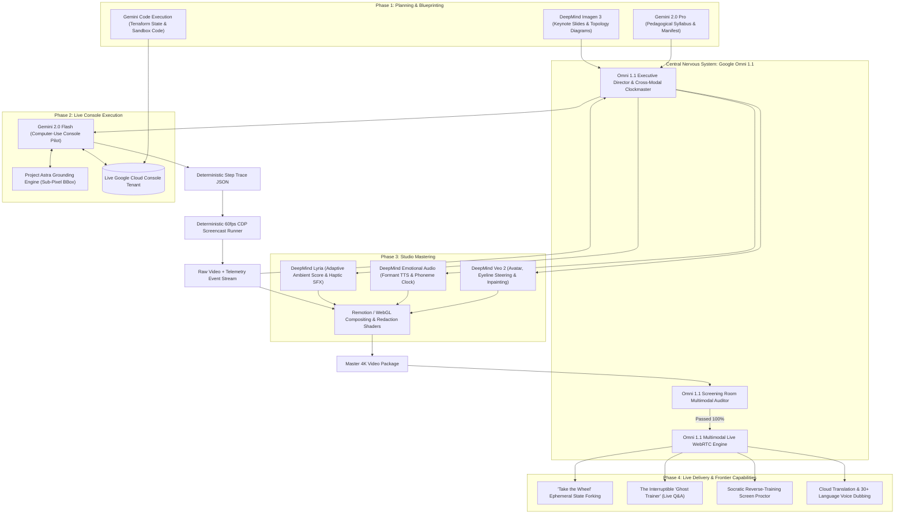

# TRAINEX: Autonomous Enterprise AI Training & Demo Studio
## Complete Architectural Blueprint & Production Specification (v3.0 Master Standard)

**Authors:** Google Principal Technical Evangelist & Google DeepMind Multimodal System Architects  
**Target Platform:** Google Cloud Platform, Gemini Omni 1.1, Gemini 2.0 Pro/Flash, Veo 2, Lyria, DeepMind Emotional TTS  
**Workspace:** `/Users/nitinagga/Documents/trainex`

---

## Table of Contents
1. [Executive Summary & The Core Thesis](#1-executive-summary--the-core-thesis)
2. [Unified System Topology & Neurological Core](#2-unified-system-topology--neurological-core)
3. [Multi-Agent Command Hierarchy & Organizational Topology (Tiers 1–5)](#3-multi-agent-command-hierarchy--organizational-topology-tiers-15)
4. [DeepMind, Google Labs & Gemini Model Matrix](#4-deepmind-google-labs--gemini-model-matrix)
5. [Where Omni Sits & What Omni Does](#5-where-omni-sits--what-omni-does)
6. [The 6 Unprecedented Frontier Capabilities](#6-the-6-unprecedented-frontier-capabilities)
7. [Hardened Production Protocols & Blindspot Remediation](#7-hardened-production-protocols--blindspot-remediation)
8. [Google Cloud Console Tactical Playbook](#8-google-cloud-console-tactical-playbook)
9. [Data Contracts: Segment Manifest & Step Trace Schemas](#9-data-contracts-segment-manifest--step-trace-schemas)
10. [Studio Compositing, Audio Mastering & Visual Polish Engine](#10-studio-compositing-audio-mastering--visual-polish-engine)
11. [Cloud Infrastructure & Distributed Container Topology](#11-cloud-infrastructure--distributed-container-topology)
12. [Implementation Roadmap & Milestones](#12-implementation-roadmap--milestones)

---

## 1. Executive Summary & The Core Thesis

Delivering world-class technical training to Fortune 500 enterprises and internal Google engineering teams has historically required dozens of hours of preparation: designing slides, rehearsing demo flows, setting up pristine cloud environments, recording dozens of flawed video takes, and painstakingly editing cursor jumps, lag, and audio blunders.

**Trainex** automates the entire lifecycle of an enterprise-grade training session—from conceptual prompt to finished 4K/60fps interactive video—featuring:
1. **A Photorealistic AI Presenter Avatar** (Veo 2 & DeepMind Face Diffusion) delivering an engaging intro, demo narration, and conclusion in an executive Google Meet / Keynote aesthetic.
2. **Dynamic Keynote-Quality Slides** rendered with crisp typography and subtle micro-animations (Imagen 3).
3. **Deterministic, Flawless Live System Demos** executed on real Google Cloud environments with automated zoom-to-action camera physics, smooth Bézier cursor dynamics, and real-time PII redaction.
4. **DeepMind Expressive Audio** (procedural voice casting, emotional nuance, vocal tract formant tuning, and audio ducking via Lyria).
5. **Instant 30+ Language Localization** with zero-loss acoustic voice cloning, lip-sync adaptation, and localized UI overlays.

### The Golden Rule: "Path B" Determinism
```
                     AGENTIC (Author Once)
Prompt + Docs ───► Gemini Omni 1.1 ───► Gemini Flash CUA ───► Step Trace (JSON)
                                                                     │
                                    ┌────────────────────────────────┘
                                    ▼
                      DETERMINISTIC (Record Every Take)
Step Trace ───► Rehearsal Matrix ───► CDP Screencast Replayer ───► Compositor ───► Master MP4
```
> **Core Architectural Principle:** Authoring is probabilistic, exploratory, and agentic; recording is strictly deterministic, replayable, and fail-closed. The LLM never touches the browser during the actual video take.

---

## 2. Unified System Topology & Neurological Core



---

## 3. Multi-Agent Command Hierarchy & Organizational Topology (Tiers 1–5)

To guarantee carrier-grade reliability with zero agent deadlocks or conversation dilution, Trainex operates on a **strictly bounded 5-tier organizational hierarchy**. The system deploys **14 Cognitive AI Roles** commanding a horizontally scalable fleet of **4 Deterministic Zero-LLM Worker types**:

```
                              THE TRAINEX COMMAND HIERARCHY
┌────────────────────────────────────────────────────────────────────────────────────────┐
│ TIER 1: THE MASTER ORCHESTRATOR                                                        │
│ └── [1] Supreme Executive Director (Google Omni 1.1)                                   │
├────────────────────────────────────────────────────────────────────────────────────────┤
│ TIER 2: SPECIALIZED PLANNERS & ARCHITECTS                                              │
│ ├── [2] Pedagogical & Syllabus Planner (Gemini 2.0 Pro)                                │
│ ├── [3] Cloud Infrastructure Architect (Gemini Code Engine)                            │
│ └── [4] Creative & Visual Director (DeepMind Creative Architect)                       │
├────────────────────────────────────────────────────────────────────────────────────────┤
│ TIER 3: DOMAIN SUPERVISORS (Quality Gates & State Transition Sentinels)                │
│ ├── [5] Console & Authoring Supervisor                                                 │
│ ├── [6] Studio Post-Production Supervisor                                              │
│ └── [7] Compliance & Screening Room Supervisor (Red Team)                              │
├────────────────────────────────────────────────────────────────────────────────────────┤
│ TIER 4: SPECIALIZED AUTONOMOUS AGENTS & SUBAGENTS                                      │
│ ├── [8]  Console Pilot Agent (Gemini 2.0 Flash CUA)                                    │
│ ├── [9]  Chaos Injection Subagent (Gemini 2.0 Flash)                                   │
│ ├── [10] Rehearsal Flake Healer Subagent (Gemini 2.0 Flash Vision)                    │
│ ├── [11] Voice Talent Agent (DeepMind Emotional TTS)                                   │
│ ├── [12] Avatar Cinematographer Agent (DeepMind Veo 2)                                 │
│ ├── [13] Score & Sound Design Agent (DeepMind Lyria)                                   │
│ └── [14] Live Socratic Proctor Agent (Omni 1.1 Multimodal Live)                         │
├────────────────────────────────────────────────────────────────────────────────────────┤
│ TIER 5: DETERMINISTIC COMPUTE WORKERS (ZERO-LLM FLEET)                                 │
│ ├── [W-1] Terraform Sandbox Provisioning Worker                                        │
│ ├── [W-2] 60fps CDP Screencast Replay Worker (Cloud NAT)                               │
│ ├── [W-3] Remotion GPU Compositing & Render Worker (NVIDIA L4)                          │
│ └── [W-4] OpenCV BBox Redaction & Frame Masking Worker                                 │
└────────────────────────────────────────────────────────────────────────────────────────┘
```

### 3.1 Tier 1: Master Orchestrator (1 Entity)
* **[1] Supreme Executive Director (Google Omni 1.1):**
  - Holds global lifecycle state machine across all 6 phases.
  - Conducts the **Master Cross-Modal Clock**: guarantees that speech cadence, camera zoom, cursor movements, and page load durations are mathematically synchronized.
  - Never speaks directly to workers; delegates strictly to Tier 2 Planners and Tier 3 Supervisors via typed JSON event schemas.

### 3.2 Tier 2: Specialized Planners & Architects (3 Entities)
* **[2] Pedagogical & Syllabus Planner (Gemini 2.0 Pro):** Decomposes topic prompt into the `manifest.v2.json` learning arc, timing budgets, role-based branching DAGs (FinOps vs. Security vs. DevOps), and narration beats.
* **[3] Cloud Infrastructure Architect (Gemini Code Engine):** Synthesizes deterministic `main.tf` Terraform code, least-privilege IAM service account definitions, and pre-seeded database/cluster states for "Cooking Show" cuts.
* **[4] Creative & Visual Director (DeepMind Creative Architect):** Designs keynote slide layouts, color token definitions (Google Cloud Dark/Light), visual emphasis targets (`emphasis_selectors`), and mood profiles for Lyria's score.

### 3.3 Tier 3: Domain Supervisors (3 Entities)
Supervisors act as **fail-closed quality firewalls**. A phase cannot advance to the next stage without a cryptographically signed approval token:
* **[5] Console & Authoring Supervisor:** Oversees sandbox authoring and rehearsal runs. Rejects any trace that fails $3/3$ consecutive runs or contains brittle Angular CSS hashes.
* **[6] Studio Post-Production Supervisor:** Coordinates Veo 2 avatar rendering, TTS audio, Lyria score, and Remotion rendering. Rejects builds with desynchronized phonemes or unnatural camera transitions.
* **[7] Compliance & Screening Room Supervisor (Red Team - Omni 1.1):** Scans every rendered frame for unmasked PII, verifies that Pre-GA features have legal disclaimer slates, and cross-audits speech vs. pixels with unilateral reject authority.

### 3.4 Tier 4: Autonomous Specialized Agents & Subagents (7 Entities)
* **[8] Console Pilot Agent (Gemini 2.0 Flash CUA):** Browser control tools; pierces Pantheon iframes and Shadow DOM; outputs `trace.v2.json`.
* **[9] Chaos Injection Subagent (Gemini 2.0 Flash):** Injects intentional 403 Forbidden / Quota errors into the sandbox to teach real debugging.
* **[10] Rehearsal Flake Healer (Gemini 2.0 Flash Vision):** Ingests failure screenshots when console UI shifts; re-anchors selectors automatically.
* **[11] Voice Talent Agent (DeepMind Emotional TTS):** 5-band vocal tract formant convolution; outputs master WAV + phoneme clock dictionary.
* **[12] Avatar Cinematographer (DeepMind Veo 2):** Steers presenter gaze vector ($-15^\circ$ azimuth toward console actions); outputs 4K avatar video.
* **[13] Score & Sound Design (DeepMind Lyria):** Generates procedural keynote music; implements $-18\text{dB}$ lookahead audio ducking.
* **[14] Live Socratic Proctor (Omni 1.1 Multimodal Live):** Operates over WebRTC; coaches the learner live during "Take the Wheel" sandbox practice.

### 3.5 Tier 5: Deterministic Compute Workers (4 Zero-LLM Worker Types)
Stateless, horizontally scalable containerized jobs running on Cloud Run:
* **[W-1] Terraform Sandbox Provisioning Worker:** Provisions and destroys ephemeral GCP sandboxes via infrastructure-as-code.
* **[W-2] 60fps CDP Screencast Replay Worker:** Headless Chrome @ 4K DPR 2 with static Cloud NAT egress; replays traces deterministically.
* **[W-3] Remotion GPU Compositing Worker:** NVIDIA L4 nodes rendering Bézier cursor splines, spring camera zoom, and WebGL shaders.
* **[W-4] OpenCV BBox Redaction Worker:** Scans frames and applies Gaussian blur over sensitive bounding boxes.

### 3.6 Escalation & Self-Healing Loop
```
1. [W-2 Replay Worker] encounters an unexpected modal ──► Flake detected.
       │
       ▼
2. [Console Supervisor] traps the error and halts recording take.
       │
       ▼
3. [Console Supervisor] dispatches DOM diff to [Rehearsal Flake Healer Subagent].
       │
       ▼
4. [Rehearsal Flake Healer] uses Gemini Flash Vision to re-anchor the selector.
       │
       ▼
5. [Rehearsal Flake Healer] commits patch to `trace.v2.json`.
       │
       ▼
6. [Console Supervisor] re-runs 3x rehearsal ──► PASS.
       │
       ▼
7. [Console Supervisor] notifies [Tier 1: Omni 1.1 Orchestrator] to resume production.
```

---

## 4. DeepMind, Google Labs & Gemini Model Matrix

Every model has an exact cognitive profile, latency envelope, and operational SLA across the system:

| Subsystem | Model / Technology | Primary Operational Responsibility | Latency / Mode |
| :--- | :--- | :--- | :--- |
| **Executive Director** | **Google Omni 1.1** | Holds the master cross-modal clock, aligns audio cadence with UI loading, conducts tempo, and acts as the central nervous system. | Real-time Streaming |
| **Instructional Designer**| **Gemini 2.0 Pro** | Decomposes topic prompt + documentation into pedagogical learning arcs, segment manifests, speaker notes, and IAM least-privilege policies. | Batch Reasoning |
| **Keynote Slide Artist** | **DeepMind Imagen 3** | Generates 16:9 keynote slide canvases, vector-grade cloud topology diagrams, and sharp pixel-accurate text typography. | Offline Batch |
| **Sandbox Automator** | **Gemini Code Execution**| Synthesizes deterministic Terraform `main.tf` and bash scripts to provision and teardown ephemeral GCP demo environments. | Fast Execution |
| **Console Pilot** | **Gemini 2.0 Flash (CUA)**| Fast, low-latency DOM explorer. Pierces Shadow DOM, resolves resilient Triad Selectors (`getByRole` $\rightarrow$ `data-test-id` $\rightarrow$ BBox), and logs step traces. | Sub-150ms Token |
| **Spatial Grounding** | **Project Astra Engine** | Sub-pixel visual grounding. Maps normalized bounding boxes `[ymin, xmin, ymax, xmax]` for canvas elements (Cloud Shell, Monaco editors, charts). | Real-time Vision |
| **Presenter Avatar** | **DeepMind Veo 2** | Generates photorealistic talking-head video in Google executive attire, directs eye gaze toward active console bounding boxes, and in-paints UI drift patches. | Generative Video |
| **Voice Talent** | **DeepMind Emotional TTS** | 5-band vocal tract formant convolution, procedural voice casting, emotional prosody, and millisecond phoneme-level timestamp generation. | Streaming Audio |
| **Score Composer** | **DeepMind Lyria** | Procedural keynote ambient score composition, lookahead audio ducking (-18dB under speech), and haptic UI click/deploy sound effects. | Procedural Audio |
| **Multimodal Live Host**| **Gemini Multimodal Live** | Sub-200ms bidirectional WebRTC voice/video interaction for the interruptible "Ghost Trainer" and Socratic screen proctoring. | Sub-200ms WebRTC |
| **Screening Room QA** | **Google Omni 1.1** | End-to-end multimodal screening of rendered MP4: detects audio-visual desyncs, missing redactions, and semantic contradictions. | Full Stream Scan |
| **Global Localization** | **Cloud Speech & Translate** | 30+ language contextual translation, voice-cloning timbre matching, and localized subtitle generation. | Streaming Batch |

---

## 5. Where Omni Sits & What Omni Does

Unlike conventional pipelines that chain disparate text, speech, and vision models, **Google Omni 1.1 is natively omni-modal**—operating across audio waveforms, video frames, and computer actions in a single unified latent space:

```
                  TRADITIONAL PIPELINE (BRITTLE & HIGH LATENCY)
Audio In ──► [STT] ──► Text ──► [LLM] ──► Text ──► [TTS] ──► Audio Out (2500ms Delay)
                                                                 (Nuance Destroyed)

                       NATIVE OMNI 1.1 (ZERO LOSS & ULTRA-FAST)
Audio In  ──┐
Video In  ──┼──► [GOOGLE OMNI 1.1 NATIVE MULTIMODAL CORE] ──► Audio Out + Video Controls
Text/DOM  ──┘                                                 (<200ms Instant Response)
```

### Omni's 4 Specialized Superpowers in Trainex:

#### 1. The Cross-Modal Clockmaster (Pre & Post-Production)
* **The Problem:** A text model cannot hear its own speech or see the browser loading. If Cloud Console takes 2 seconds longer to provision, text-based voiceover talks over blank screens.
* **Omni's Action:** Omni monitors raw CDP screencast frames and audio waveforms concurrently. If a network delay occurs, Omni **elastically stretches vowels, inserts conversational pauses, or adds spontaneous commentary** (*"Now... while Cloud Run allocates regional containers..."*), maintaining 100% audio-visual synchronization.

#### 2. The Interruptible "Ghost Trainer" (In-Playback Interventions)
* **The Problem:** Video is traditionally a dead, non-interactive wall.
* **Omni's Action:** Omni is embedded into the web player via the Gemini Multimodal Live API over WebRTC. When the viewer speaks (*"Wait, why didn't you enable VPC peering?"*), Omni intercepts the speech waveform directly, halts video playback in $<200\text{ms}$, instructs Veo 2 to turn the avatar toward the viewer, explains the architectural trade-off verbally, and smoothly resumes the master timeline.

#### 3. The Socratic Screen Proctor ("Take the Wheel" Mode)
* **The Problem:** Online training ends in passive quizzes; learners freeze when given a real cloud console.
* **Omni's Action:** In reverse-training mode, Omni ingests the viewer's live 30fps shared screen and microphone feed via WebRTC. When the viewer attempts to create a firewall rule with `0.0.0.0/0`, Omni intervenes verbally in real time (*"Hold on—that exposes the subnet to the public internet. What internal CIDR block should we use?"*) while drawing an interactive highlight around the correct input field.

#### 4. The Final "Screening Room" QA Gatekeeper
* **The Problem:** Text linters cannot detect whether a presenter said "Click Europe-West1" while the cursor clicked "US-Central1".
* **Omni's Action:** Omni watches the final master 4K MP4 end-to-end. It cross-references spoken phonemes, on-screen bounding boxes, and security policies. If an unblurred billing account number or semantic contradiction is detected, Omni fails the build and triggers surgical remediation.

---

## 6. The 6 Unprecedented Frontier Capabilities

### 1. "Take the Wheel" (Instant Ephemeral State Forking)
* At any timestamp in the video, a glowing overlay button appears: `[ Take the Wheel ]`.
* Clicking it halts the video and launches an in-browser Cloud Shell / WebContainer pre-seeded with the **exact millisecond state** of the demo project at that moment.
* The learner tests custom parameters or runs code, then clicks `[ Resume Masterclass ]` to return to the video.

### 2. The Interruptible "Ghost Trainer"
* Bidirectional WebRTC audio connection embedded in the video player.
* Allows natural human voice interruptions at any second.
* Presenter breaks character, makes eye contact, answers with deep contextual reasoning, and resumes seamlessly.

### 3. Antifragile "Chaos Demos" (Pedagogy via Deliberate Production Failure)
* Deliberately rejects the artificial "Happy Path."
* Gemini Omni programs the authoring agent to inject authentic production failures (e.g., IAM `403 Forbidden`, Quota Exceeded, VPC route blackholes).
* The presenter walks the learner through Cloud Logging, identifies the root cause, repairs the configuration, and achieves green status—imparting real senior engineering intuition.

### 4. Continuous Integration for Video (Self-Healing Evergreen Library)
* Video assets stored as code: `manifest.yaml` + `trace.json` in Git.
* Nightly Cloud Run CI runs rehearsal against GCP Console.
* When Google Cloud updates a UI layout, the pipeline isolates the 3-second drift window, re-records the delta, and uses **Veo 2 Neural Inpainting** to patch the video stream without a full re-render. Videos never expire.

### 5. Polymorphic Multi-Role Compilation (1 Prompt $\rightarrow$ 4 Personas)
* A single topic prompt compiles into a Multi-Dimensional DAG:
  - **CFO / FinOps:** Focuses on TCO, Committed Use Discounts, and idle scale-to-zero.
  - **CISO / Security:** Focuses on VPC-SC, CMEK, Binary Authorization, and least-privilege IAM.
  - **DevOps / Platform:** Focuses on Terraform, autoscaling thresholds, and canary traffic splitting.
  - **Developer:** Focuses on SDK calls, local debugging, and container runtimes.
* Viewer SSO selects or toggles their persona dynamically.

### 6. Socratic Reverse-Training (Live WebRTC Proctor)
* Hands-on certification challenge at the conclusion of the video.
* Learner attempts to solve a real cloud task in an isolated sandbox.
* Omni watches the learner's screen live over WebRTC, providing real-time Socratic voice hints and issuing a cryptographically signed Proof-of-Competence Certificate upon completion.

---

## 7. Hardened Production Protocols & Blindspot Remediation

### Remediation 1: Temporal Elasticity & Phoneme-Anchored Pacing
* **The Failure Mode:** Narration script takes 45 seconds; 3 console clicks take 8 seconds. Result: Cursor freezes awkwardly for 37 seconds.
* **The Fix:** Speech is authored in sentence-level beats mapped to step IDs. DeepMind TTS generates millisecond phoneme timestamps. The Remotion compositor injects subtle camera pan drifts, highlight pulses, or secondary inspection scrolls during speech holds so the screen never appears static.

### Remediation 2: Datacenter IP & Google Identity Banishment
* **The Failure Mode:** Cloud Run containers use Google Cloud IP ranges (`Google LLC`). Unpacking a Mac Chrome profile into Cloud Run triggers Google Accounts bot detection ("Verify it's you", CAPTCHA, 2FA).
* **The Fix:**
  1. Route all Cloud Run worker traffic through a Serverless VPC Access Connector tied to a **Cloud NAT with static residential/enterprise egress IP pools**.
  2. Seed the session profile using a **dedicated Linux Headful Bastion container** matching the Cloud Run container's hardware concurrency, WebGL vendor, and canvas hash.
  3. Deploy Chrome Enterprise Policy (`/etc/opt/chrome/policies/managed/`) disabling credential rotation challenges for the dedicated training service account.

### Remediation 3: Micro-Frontends & Shadow DOM (Pantheon Shell)
* **The Failure Mode:** Google Cloud Console embeds BigQuery Studio, Cloud Shell, and Vertex AI inside nested `<iframe>` elements and closed Shadow DOM roots. Standard Puppeteer `page.click()` fails.
* **The Fix:**
  1. Attach CDP to all sub-targets using `Target.setAutoAttach` with `flatten: true`.
  2. Authoring agent emits **Deep-Pierce Selectors** (`pierce/button[aria-label="Deploy"]`) that traverse shadow roots.
  3. For HTML5 canvases (xterm.js in Cloud Shell), fall back to **normalized relative canvas coordinates** (`{ x_pct: 0.42, y_pct: 0.18 }`).

### Remediation 4: Resource Naming & GCP Deletion Tombstones
* **The Failure Mode:** Rehearsal runs recreate the same resource name; GCP deletion tombstones take 90+ seconds to release names, causing `409 Conflict`.
* **The Fix:**
  - Traces use semantic token templates: `resource-{{RUN_HASH_5}}`.
  - Rehearsal uses a **Dual Ephemeral Project Pool** ($Project_A$ records while $Project_B$ runs background terraform teardown/rebuild).

### Remediation 5: Console Experiments & A/B Flighting
* **The Failure Mode:** Google deploys experimental feature flags (`PantheonFlags`), altering button labels mid-week.
* **The Fix:**
  - Inject HTTP request header `X-Goog-Experiments-Override: disable_all_flights` and pin local storage experiment flags.
  - Multimodal Visual Fallback: If a selector fails during rehearsal, Gemini 2.0 Flash Vision inspects the screenshot, identifies the relocated button, and automatically commits a trace patch.

### Remediation 6: Avatar Eyeline Uncanny Valley
* **The Failure Mode:** Presenter avatar stares straight into the camera lens while actions occur across the screen.
* **The Fix:** Feed step bounding boxes $(X, Y)$ into Veo 2 gaze conditioning. When a click occurs on the left, the avatar shifts gaze by $-15^\circ$ azimuth toward the element for 1.2s before returning eye contact to the viewer.

### Remediation 7: Legal, NDA & PII Compliance
* **The Failure Mode:** Internal Googler LDAPs (`@google.com`) or customer billing IDs leak in raw screen captures.
* **The Fix:**
  - Compositor renders a moving, semi-transparent NDA watermark: `"Confidential - Under NDA - Prepared for [Customer Name]"`.
  - Deterministic Legal Disclaimer Slate injected at `00:00:02` for pre-GA/Preview features.
  - Automated OCR scrubber scans every frame for `@google.com` or `01XXXX-XXXXXX-XXXXXX` and fails closed if unblurred.

---

## 8. Google Cloud Console Tactical Playbook

### 1. The 80/20 Navigation Split (URL-First)
Never write fragile steps that navigate through navigation menus. Jump straight to canonical URLs:
* **Vertex AI Model Garden:** `https://console.cloud.google.com/vertex-ai/model-garden?project={PROJECT_ID}`
* **Cloud Run Services:** `https://console.cloud.google.com/run?project={PROJECT_ID}`
* **BigQuery Studio:** `https://console.cloud.google.com/bigquery?project={PROJECT_ID}&ws=!1m0`
* **GKE Clusters:** `https://console.cloud.google.com/kubernetes/list/overview?project={PROJECT_ID}`

### 2. Managing Long-Running Operations (LROs)
1. **The "Cooking Show" Cut (Pre-Provisioned State):** Click submit, capture the creation toast, immediately cut to the pre-seeded completed resource URL.
2. **The "Keynote Warp" (Time Compression):** Record real provisioning; compositor applies a 15x temporal warp with a modern pulsing progress banner (`"Provisioning 3 regional nodes..."`), while narration explains the underlying architecture.

### 3. Clean Console Viewport Injection
Suppress Google Cloud promotional clutter on page load:
```javascript
await page.evaluateOnNewDocument(() => {
  const style = document.createElement('style');
  style.textContent = `
    .cfc-feedback-button, .cloud-tour-banner, 
    .console-whats-new-banner, div[aria-label="Take a tour"],
    .goog-inline-block.cfc-survey-banner { 
      display: none !important; 
    }
  `;
  document.head.appendChild(style);
});
```

---

## 9. Data Contracts: Segment Manifest & Step Trace Schemas

### 9.1 Segment Manifest (`manifest.v2.json`)
```json
{
  "$schema": "https://trainex.google.internal/schemas/manifest.v2.json",
  "course_id": "vertex-gemini-enterprise-deploy",
  "title": "Production Deployment of Gemini 2.0 on Vertex AI",
  "target_roles": ["devops", "security", "finops", "developer"],
  "presenter_profile": {
    "voice_id": "deepmind-expressive-david",
    "avatar_model": "veo-2-google-trainer-m01",
    "tone": "senior_technical_evangelist"
  },
  "segments": [
    {
      "segment_id": "seg_01_intro",
      "kind": "keynote_presentation",
      "title": "Architecture & Production Constraints",
      "target_duration_s": 45,
      "slide_ref": "slides/arch_overview.svg",
      "narration_beats": [
        {
          "beat_id": "b1",
          "text": "Welcome. Today we deploy Gemini 2.0 Flash into an enterprise VPC with zero public exposure.",
          "emotion": "confident_welcoming",
          "pause_after_ms": 300
        }
      ],
      "presenter_mode": "full_frame_hero"
    },
    {
      "segment_id": "seg_02_console_demo",
      "kind": "live_console_demo",
      "title": "Model Garden Configuration & Private Endpoint",
      "target_duration_s": 75,
      "trace_ref": "traces/vertex_deploy_v2.json",
      "presenter_mode": "pip_bottom_right",
      "emphasis_selectors": [
        "button[aria-label='Deploy Model']",
        "input[data-test-id='min-replica-count']"
      ],
      "chaos_injection": {
        "enabled": true,
        "step_trigger": 4,
        "simulated_error": "403_IAM_PERMISSION_DENIED",
        "pedagogical_lesson": "Diagnosing missing roles in Cloud Logging"
      }
    }
  ]
}
```

### 9.2 Step Trace (`trace.v2.json`)
```json
{
  "trace_version": "2.0",
  "workflow": "vertex_ai_endpoint_create",
  "preconditions": {
    "auth_profile": "gcs://trainex-vault/sessions/linux-session-v2.tar.gz",
    "entry_url": "https://console.cloud.google.com/vertex-ai/model-garden?project=trainex-demo-sandbox",
    "project_id": "trainex-demo-sandbox"
  },
  "steps": [
    {
      "step_id": 1,
      "action": "goto",
      "url": "https://console.cloud.google.com/vertex-ai/model-garden?project=trainex-demo-sandbox",
      "wait_for": { "type": "selector_visible", "selector": "[aria-label='Model Garden search']" },
      "hold_ms": 600
    },
    {
      "step_id": 2,
      "action": "type",
      "selector_hierarchy": [
        { "strategy": "aria", "value": "input[aria-label='Search models']" },
        { "strategy": "test_id", "value": "input[data-test-id='mg-search-bar']" },
        { "strategy": "spatial", "bbox": [120, 340, 160, 680] }
      ],
      "text": "Gemini 2.0 Flash",
      "typing_speed_wpm": 72,
      "wait_for": { "type": "network_idle" },
      "hold_ms": 400
    },
    {
      "step_id": 3,
      "action": "click",
      "selector_hierarchy": [
        { "strategy": "aria", "value": "button[aria-label='Deploy Model']" },
        { "strategy": "pierce", "value": "pierce/button[data-test='deploy-action']" },
        { "strategy": "spatial", "bbox": [420, 890, 460, 980] }
      ],
      "wait_for": { "type": "selector_visible", "selector": ".deployment-drawer" },
      "assert": { "selector": ".drawer-title", "contains_text": "Endpoint Configuration" },
      "hold_ms": 1000
    }
  ]
}
```

---

## 10. Studio Compositing, Audio Mastering & Visual Polish Engine

```
┌────────────────────────────────────────────────────────────────────────┐
│  MASTER 4K VIRTUAL STAGE (3840x2160 @ 60fps)                           │
│                                                                        │
│   ┌──────────────────────────────────────────────┐  ┌───────────────┐  │
│   │                                              │  │  VEO 2 AVATAR │  │
│   │     DYNAMIC FOCAL ZOOM (Spring Physics)      │  │  (Gaze Steered│  │
│   │                                              │  │   -15° toward │  │
│   │     [ Deploy Model Button ] ◄── Synthetic   │  │   action area) │  │
│   │         (Halo Ripple)           Minimum Jerk │  │  PiP Capsule  │  │
│   │                                 Bézier Cursor│  └───────────────┘  │
│   │                                              │                     │
│   └──────────────────────────────────────────────┘                     │
│                                                                        │
│   [Automated Gaussian Blur Mask: Billing ID & Corporate Email]         │
│   [Dynamic NDA Watermark: "Confidential - Prepared for Customer"]      │
│   [DeepMind Emotional Audio + Lyria Score with -18dB Lookahead Ducking]│
└────────────────────────────────────────────────────────────────────────┘
```

1. **Synthetic Cursor Physics (Minimum Jerk Model):**
   $$x(t) = x_0 + (x_1 - x_0) \left( 10\left(\frac{t}{D}\right)^3 - 15\left(\frac{t}{D}\right)^4 + 6\left(\frac{t}{D}\right)^5 \right)$$
   Computes natural velocity curves with human micro-overshoot and 150ms dwell confirmation before mousedown.
2. **Click Ripple & Audio Haptics:**
   Emits an expanding frosted gold/blue halo ring on mousedown, paired with an acoustic UI click sound.
3. **Spring-Damped Camera Zoom:**
   Reads target element `bbox` and zooms smoothly from 100% to 160% focal view using spring physics ($k=180, c=18$), centering the action while keeping the presenter capsule unobstructed.
4. **Adaptive Audio Ducking (Lyria):**
   Music envelope compressor attenuates the background track by -18dB 200ms ahead of spoken phonemes, with a smooth 1200ms release back to baseline during pauses.

---

## 11. Cloud Infrastructure & Distributed Container Topology

```
                                    ┌────────────────────────┐
                                    │ Cloud Run Studio API   │
                                    │   (FastAPI / Next.js)  │
                                    └───────────┬────────────┘
                                                │
                          ┌─────────────────────┴─────────────────────┐
                          ▼                                           ▼
               ┌─────────────────────┐                     ┌─────────────────────┐
               │  Cloud Tasks Queue  │                     │  Firestore Metadata │
               │   (Job Dispatcher)  │                     │ (Traces & Manifest) │
               └──────────┬──────────┘                     └─────────────────────┘
                          │
          ┌───────────────┼───────────────┐
          ▼               ▼               ▼
   ┌─────────────┐ ┌─────────────┐ ┌─────────────┐
   │ Cloud Run:  │ │ Cloud Run:  │ │ Cloud Run:  │  (Ephemeral Docker Containers:
   │ Authoring   │ │ Rehearsal & │ │ Studio      │   Ubuntu 24.04 + Chrome Shell +
   │ (Flash CUA) │ │ CDP Replay  │ │ Render (GPU)│   Xvfb + PulseAudio + ffmpeg)
   └──────┬──────┘ └──────┬──────┘ └──────┬──────┘
          │               │               │
          └───────────────┼───────────────┘
                          │ (Egress via Serverless VPC Connector + Cloud NAT)
                          ▼
            ┌───────────────────────────┐
            │ Google Cloud Storage (GCS)│
            │   - Session Tarballs      │
            │   - Raw 4K Screencasts    │
            │   - Audio Masters         │
            │   - Final Deliverables    │
            └───────────────────────────┘
```

---

## 12. Implementation Roadmap & Milestones

| Milestone | Deliverable | Success Criteria |
| :--- | :--- | :--- |
| **M1: Data Contracts & Runner Scaffold** | TypeScript schemas for `manifest.v2.json` and `trace.v2.json`; headless Chrome CDP replay engine. | Deterministic replay of a 5-step GCP console flow with 0% flakiness across 5 runs. |
| **M2: Synthetic Cursor & Camera Director** | Minimum-jerk Bézier cursor generator + Remotion spring-damped zoom compositor. | Human-indistinguishable mouse movement with click ripple and automated focus pulling. |
| **M3: Omni & DeepMind Audio Pipeline** | Gemini Omni 1.1 Manifest compiler + DeepMind Emotional TTS integration with phoneme alignment. | Speech generated with emotional prosody and millisecond phoneme clock driving Remotion. |
| **M4: Veo 2 Avatar & Inpainting** | Talking-head presenter rendering in PiP capsule with BBox-directed eyeline tracking. | Avatar gaze visibly shifts toward console action coordinates during clicks. |
| **M5: Frontier "Take the Wheel" & WebRTC** | Ephemeral sandbox state-forking and Gemini Multimodal Live interactive interruptions. | Sub-250ms conversational interruption and live state cloning in browser. |
