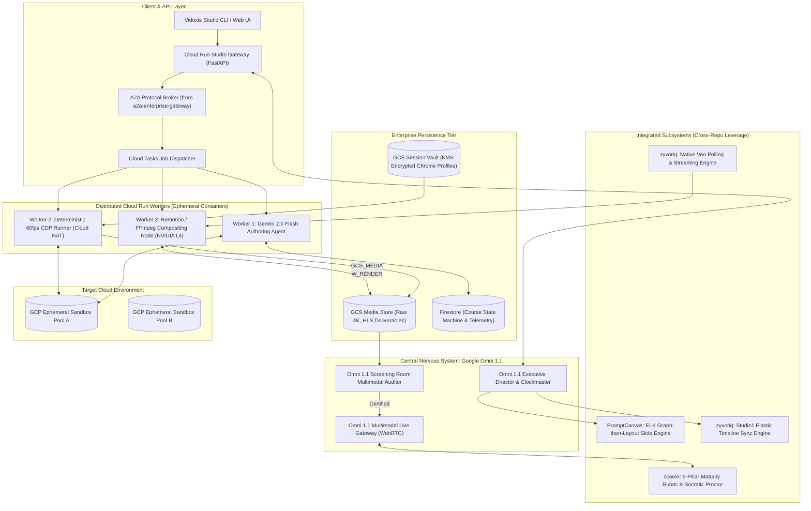

# Vidoxis System Architecture & Distributed Engineering Specification
**Version:** 3.0 (Master Production Standard)  
**Authors:** Google Principal Technical Evangelist & Google DeepMind Multimodal System Architects  
**Workspace:** `/Users/nitinagga/Documents/vidoxis`

---

## 1. System Overview & The "Path B" Axiom

Vidoxis is an autonomous enterprise AI studio that generates broadcast-quality technical training videos, keynote slide decks, and live system demos using real cloud environments.

### The Core Architectural Axiom: "Path B" Determinism
```
                     AGENTIC (Author Once)
Prompt + Specs ──► Gemini Omni 1.1 ──► Gemini Flash CUA ──► Step Trace (JSON)
                                                                   │
                                  ┌────────────────────────────────┘
                                  ▼
                    DETERMINISTIC (Record Every Take)
Step Trace ──► Rehearsal Matrix ──► CDP Screencast Replayer ──► Remotion Studio ──► Master 4K MP4
```
* **Authoring is Agentic and Probabilistic:** Gemini 2.0 Flash Computer-Use Agent navigates the sandbox, discovers UI paths, handles transient layout shifts, and emits a frozen, auditable **Step Trace JSON**.
* **Recording is Strictly Deterministic:** Replayed via Chrome DevTools Protocol (CDP) at 60fps with zero LLM in the loop. The browser clock is stubbed, animations are reduced, and coordinates are logged to a millisecond event stream.

---

## 2. End-to-End Distributed Topology



### 2.1 The Atomic Dual-Artifact Rehearsal & Replay Contract
A rehearsal or recording take is incomplete and invalid if it only emits telemetry JSON without the underlying video pixels. Replay workers must enforce an atomic dual-output contract:
1. **Telemetry Event Stream (`telemetry.json`):** Frame-indexed cursor vectors, waypoints, BBoxes, spring camera states, and PII markers.
2. **Physical Screencast Frame Buffer (`raw_screencast.mp4` / JPEG frame buffer):** Real visual pixel buffer captured via CDP `Page.startScreencast` with frame acknowledgments (`Page.screencastFrameAck`) or `HeadlessExperimental.beginFrame`.

### 2.2 Universal Shadow DOM Tree-Walker Algorithm (`querySelectorAllDeep`)
To pierce micro-frontend Web Components in Google Cloud Console (Pantheon) and AWS Console, all element selectors must execute a recursive tree walker traversing all open `shadowRoot` nodes:
```ts
function querySelectorAllDeep(root: Node = document): Element[] {
  const elements: Element[] = [];
  function traverse(node: Node) {
    if (node instanceof Element) {
      elements.push(node);
      if (node.shadowRoot) {
        for (const child of node.shadowRoot.children) traverse(child);
      }
    }
    for (const child of node.childNodes) traverse(child);
  }
  traverse(root);
  return elements;
}
```

### 2.3 Coordinate Space Mapping Matrix (1080p CSS to 4K DPR 2 Master Canvas)
Chrome captures at 1920×1080 with `deviceScaleFactor: 2`, producing a 3840×2160 physical pixel raster. To prevent cursor and highlight quadrant compression in Remotion:
$$(X_{\text{4K}}, Y_{\text{4K}}) = (X_{\text{CSS}} \times \text{scaleFactor}, Y_{\text{CSS}} \times \text{scaleFactor}) \quad \text{where } \text{scaleFactor} = 2.0$$

### 2.4 Autonomous Failure Diagnostic Snapshotting Pipeline
Whenever a step condition gate times out or a selector resolution fails during headless rehearsal:
1. The runner must immediately capture `scratch/failures/{step_id}_failure.png`.
2. The runner must serialize the full live HTML DOM tree to `scratch/failures/{step_id}_dom.html`.
3. The hook emits these exact URIs to Tier 3 Domain Supervisors for automated healing.

### 2.5 Google-Signed Micro-Version Chrome & Cloudtop Binary Matrix
To eliminate Santa endpoint security blocking (`Killed: 9` on unnotarized binaries like `chrome-headless-shell`), the execution layer enforces a unified binary resolution hierarchy across macOS and Cloudtop workstations:
1. **macOS Host Resolution:** Discovers `/Applications/Google Chrome.app/Contents/MacOS/Google Chrome` and verifies code signing authority matching `Developer ID Application: Google LLC (EQHXZ8M8AV)`.
2. **Cloudtop / Linux Parity:** Automatically maps to `/usr/bin/google-chrome`, `/usr/bin/google-chrome-stable`, or `/opt/google/chrome/chrome` installed via Google internal apt repositories.
3. **Micro-Version Telemetry Guard:** Captures the full four-component semantic version (e.g. `153.0.8010.36`) and emits it into step telemetry to guarantee deterministic browser layout engine matching across authoring, rehearsal, and Remotion video rendering.

---

## 3. Multi-Agent Command Hierarchy (Tiers 1–5)

To eliminate agent deadlocks and conversational dilution, Vidoxis enforces strict vertical delegation across **14 Cognitive AI Roles** commanding **4 Deterministic Compute Worker types**:

```
                              THE VIDOXIS COMMAND HIERARCHY
┌────────────────────────────────────────────────────────────────────────────────────────┐
│ TIER 1: THE MASTER ORCHESTRATOR                                                        │
│ └── [1] Supreme Executive Director (Google Omni 1.1)                                   │
│         - Master Cross-Modal Clock & Global State Machine Conductor                    │
├────────────────────────────────────────────────────────────────────────────────────────┤
│ TIER 2: SPECIALIZED PLANNERS & ARCHITECTS                                              │
│ ├── [2] Pedagogical & Syllabus Planner (Gemini 2.5 Pro) ──► Manifest & Timing Budgets │
│ ├── [3] Cloud Infrastructure Architect (Gemini Code Engine) ──► Terraform & Sandboxes  │
│ └── [4] Creative & Visual Director (DeepMind Creative Architect) ──► Slides & Tokens   │
├────────────────────────────────────────────────────────────────────────────────────────┤
│ TIER 3: DOMAIN SUPERVISORS (Quality Firewalls & Circuit Breakers)                      │
│ ├── [5] Console & Authoring Supervisor ──► 3/3 Pass Gate; Bans Angular Hashes         │
│ ├── [6] Studio Post-Production Supervisor ──► Phoneme Alignment & Render Gate         │
│ └── [7] Compliance & Screening Room Supervisor (Red Team - Omni 1.1) ──► Unilateral Veto│
├────────────────────────────────────────────────────────────────────────────────────────┤
│ TIER 4: SPECIALIZED AUTONOMOUS AGENTS & SUBAGENTS                                      │
│ ├── [8]  Console Pilot Agent (Gemini 2.5 Flash CUA) ──► Shadow DOM & Triad Selectors  │
│ ├── [9]  Chaos Injection Subagent (Gemini 2.5 Flash) ──► 403 / Quota Failure Pedagogy  │
│ ├── [10] Rehearsal Flake Healer (Gemini 2.5 Flash Vision) ──► Auto-Reanchoring        │
│ ├── [11] Voice Talent Agent (DeepMind Emotional TTS) ──► 5-Band Formants & Phonemes   │
│ ├── [12] Avatar Cinematographer (DeepMind Veo 2) ──► Gaze-Steered (-15° Azimuth) PiP   │
│ ├── [13] Score & Sound Design Agent (DeepMind Lyria) ──► Lookahead -18dB Ducking       │
│ └── [14] Live Socratic Proctor Agent (Omni 1.1 Multimodal Live) ──► WebRTC Mentorship  │
├────────────────────────────────────────────────────────────────────────────────────────┤
│ TIER 5: DETERMINISTIC COMPUTE WORKERS (ZERO-LLM CLOUD RUN FLEET)                       │
│ ├── [W-1] Terraform Sandbox Provisioning Worker (Infrastructure-as-Code)               │
│ ├── [W-2] 60fps CDP Screencast Replay Worker (Headless Chrome + Cloud NAT Egress)      │
│ ├── [W-3] Remotion GPU Compositing & Render Worker (NVIDIA L4 + WebGL Shaders)         │
│ └── [W-4] OpenCV BBox Redaction & Frame Masking Worker (Gaussian Blur Shaders)         │
└────────────────────────────────────────────────────────────────────────────────────────┘
```

---

## 4. Cross-Repository Subsystem Leverage Map

Vidoxis strategically integrates proven modules from existing sister repositories in `/Users/nitinagga/Documents/`:

```
┌──────────────────────────────────────────────────────────────────────────────────────────────────┐
│                                 CROSS-REPOSITORY INTEGRATION MAP                                 │
│                                                                                                  │
│   zyvoriq                     PromptCanvas                 scorex            a2a-gateway         │
│   ┌─────────────────────┐     ┌─────────────────────┐     ┌──────────────┐   ┌─────────────────┐ │
│   │ • studio1_timeline_ │     │ • Pipeline V2       │     │ • 6-Pillar   │   │ • a2a_sdk       │ │
│   │   sync.mjs (Elastic │     │   Graph-then-Layout │     │   Maturity   │   │ • RPC Messaging │ │
│   │   Pacing Math)      │     │   (ELKJS + Draw.io) │     │   Rubric     │   │ • Cloud Run /   │ │
│   │ • poll_native_veo.js│     │ • Official GCP Icon │     │ • Socratic   │   │   gRPC Dual-    │ │
│   │ • word_timing_guard │     │   SVG Templates     │     │   Grading    │   │   Plane Gateway │ │
│   └──────────┬──────────┘     └──────────┬──────────┘     └──────┬───────┘   └────────┬────────┘ │
│              │                           │                       │                    │          │
│              ▼                           ▼                       ▼                    ▼          │
│   ┌──────────────────────────────────────────────────────────────────────────────────────────┐   │
│   │                           VIDOXIS PRODUCTION CORE ENGINE                                 │   │
│   └──────────────────────────────────────────────────────────────────────────────────────────┘   │
└──────────────────────────────────────────────────────────────────────────────────────────────────┘
```

### 4.1 From `zyvoriq` (Media & Timeline Synchronization)
1. **`studio1_timeline_sync.mjs` (Elastic Pacing Engine):**
   - Directly imports the sub-frame synchronization math:
     ```javascript
     const MIN_SCENE_SEC = 0.12;
     const MAX_BOUNDARY_DRIFT_MS = 50;
     const MAX_RETIME_FACTOR = 1.10;
     const MIN_RETIME_FACTOR = 0.92; // Max 8% speedup compression floor
     ```
   - Dynamically retimes console hold regions ($0.92\times$ to $1.10\times$) so narration speech beats align cleanly with UI events without awkward visual freezing.
2. **`poll_native_veo.js` (Native Veo Generation):**
   - Polls `models/veo-3.1-generate-preview` or `veo-2` operations via the Gemini API, handles exponential backoff, streams raw video buffers to disk, and tracks operation IDs.
3. **`transcription_word_timing_guard.mjs`:**
   - Enforces word-level phoneme boundaries, preventing speech truncation during video cut transitions.

### 4.2 From `PromptCanvas` (Keynote Slide Architecture Engine)
1. **Pipeline V2 (Graph-then-Layout Engine):**
   - Vidoxis's **Creative Director (Agent #4)** delegates slide architecture diagramming directly to PromptCanvas:
     - Step 1: Gemini emits logical graph (`WHAT nodes exist and HOW they connect`).
     - Step 2: `elkjs` computes 100% collision-free $(x, y, w, h)$ coordinates with layer hierarchy.
     - Step 3: mxGraph renderer exports high-contrast, vector-grade SVG/XML containing **official Google Cloud vendor logos** (Cloud Armor, Vertex AI, Cloud Run, Cloud SQL, BigQuery).
   - Guarantees zero AI hallucination of diagram layouts or messy arrow crossings.

### 4.3 From `scorex` (Socratic Reverse-Training Assessment)
1. **6-Pillar Maturity Rubric & Grading Models:**
   - Powers Frontier Feature #6 (**Socratic Reverse-Training**).
   - Ingests learner cloud actions from Cloud Asset Inventory and evaluates them against the 5-level maturity rubric (Initial $\rightarrow$ Experiment $\rightarrow$ Develop $\rightarrow$ Optimize $\rightarrow$ Innovate).
   - Translates detected cloud anti-patterns (e.g., exposing `0.0.0.0/0` on port 22) into specific remedial guidance.

### 4.4 From `a2a-enterprise-gateway` (Multi-Agent Protocol Broker)
1. **Agent-to-Agent SDK (`a2a_sdk`):**
   - Handles structured inter-agent RPC messaging and task dispatching across the 5 tiers.
   - Enforces signed execution tokens and mutual authentication between Cloud Run microservices.

---

## 5. Critical Production Loopholes & Hardened Remediations

```
┌──────────────────────────────────────┬──────────────────────────────────────────┬──────────────────────────────────────────┐
│ Production Loophole                  │ Fatal Failure Scenario                   │ Hardened Architectural Fix               │
├──────────────────────────────────────┼──────────────────────────────────────────┼──────────────────────────────────────────┤
│ 1. Sandbox Teardown Blast-Radius     │ Typo in env var triggers `terraform      │ Immutable Regex Project Name Guardrail:  │
│    (Accidental Production Deletion)  │ destroy` against a real corporate project│ `^(?:vidoxis|trainex)-(sandbox|ephem)-`  │
├──────────────────────────────────────┼──────────────────────────────────────────┼──────────────────────────────────────────┤
│ 2. Linux vs. Mac Font Metric Drift   │ Missing Google Sans in Ubuntu causes 4%  │ Bit-for-bit bundled TTF font package in  │
│    (Text-Wrap Coordinate Shifts)     │ text reflow; button wraps; clicks miss.  │ Docker container + fontconfig pinning.   │
├──────────────────────────────────────┼──────────────────────────────────────────┼──────────────────────────────────────────┤
│ 3. Mid-Take Session Cookie Death     │ Google OAuth expires on segment 6 of 8;  │ Pre-Flight Session Health Probe with     │
│    (The 45-Minute Token Wall)        │ redirect to accounts.google.com kills run│ automated OAuth refresh token exchange.  │
├──────────────────────────────────────┼──────────────────────────────────────────┼──────────────────────────────────────────┤
│ 4. "Take the Wheel" FinOps Bleed     │ Viewers abandon 500 sandboxes; idle cloud│ Tier 1 client-side WebContainers (Wasm); │
│    (Crypto-Mining & Resource Abuse)  │ infrastructure racks up $10k bill.       │ Tier 2 hard 15m TTL + 1 vCPU quota lock. │
├──────────────────────────────────────┼──────────────────────────────────────────┼──────────────────────────────────────────┤
│ 5. Asynchronous Console Pop-Up Spies │ "Try Vertex AI Search!" modal appears;   │ CDP Mutation Observer Daemon that kills  │
│    (Click Interception)              │ backdrop overlay intercepts click target.│ promos and surveys in 0ms before paint.  │
└──────────────────────────────────────┴──────────────────────────────────────────┴──────────────────────────────────────────┘
```

### 5.1 Sandbox Teardown Blast-Radius Firewall
```typescript
export function assertSafeSandboxProject(projectId: string): void {
  const SAFE_SANDBOX_REGEX = /^(?:vidoxis|trainex)-(sandbox|ephem)-[a-z0-9]{4,8}$/;
  if (!SAFE_SANDBOX_REGEX.test(projectId)) {
    throw new Error(
      `FATAL SECURITY VIOLATION: Refusing to execute operations on project '${projectId}'. ` +
      `Target project ID does not match ephemeral sandbox naming convention: ${SAFE_SANDBOX_REGEX}`
    );
  }
}
```

### 5.2 Bit-for-Bit Typography & Linux Font Metric Pinning
* Ubuntu Docker container bundles official TTF font files at `/usr/share/fonts/truetype/google/`:
  - `GoogleSansFlex-VF.ttf`, `GoogleSans-Regular.ttf`, `GoogleSans-Medium.ttf`
  - `Roboto-Regular.ttf`, `RobotoMono-Regular.ttf`
* Fontconfig maps `system-ui` and `sans-serif` to `Google Sans Flex`, guaranteeing identical character advance widths between authoring on macOS and replaying on Linux.

### 5.3 Asynchronous Modal & Survey Interception Daemon
Injects a Mutation Observer on `Page.addScriptToEvaluateOnNewDocument` that destroys promotional overlays in 0ms:
```javascript
await page.evaluateOnNewDocument(() => {
  const dismissPromos = () => {
    const garbageSelectors = [
      'div[role="dialog"][aria-label*="tour" i]',
      'div[role="dialog"][aria-label*="survey" i]',
      'div[role="dialog"][aria-label*="feedback" i]',
      '.cfc-survey-banner',
      '.cdk-overlay-backdrop',
      'button[aria-label="Dismiss"]',
      'button[aria-label="Close"]'
    ];
    garbageSelectors.forEach(sel => {
      document.querySelectorAll(sel).forEach(el => el.tagName === 'BUTTON' ? el.click() : el.remove());
    });
  };
  new MutationObserver(dismissPromos).observe(document.documentElement, { childList: true, subtree: true });
});
```

---

## 6. Real-Time Audio-Video Elastic Synchronization Engine

```
                                  MASTER CLOCK SYNCHRONIZATION
┌──────────────────────────────────────────────────────────────────────────────────────────────────┐
│                                                                                                  │
│   Audio Timebase: 48,000 Hz, 16-Bit PCM WAV (FFmpeg 64-bit Sinc Resampler)                       │
│   Video Timebase: 60.000 fps (1 Frame = exactly 16.6666... ms)                                   │
│                                                                                                  │
│   TTS Word Marker:  "Autoscaling" ──► t_start = 1,420 ms                                         │
│   Quantized Frame:  Frame = round(1,420 * 0.06) = Frame 85                                       │
│                                                                                                  │
│   [ Frame 0 ] ────────── [ Frame 85 ] ──────────────── [ Frame 120 ] ──────────── [ Frame 240 ] │
│   Camera: 100% Wide       Camera Springs to BBox       Cursor Clicks BBox          Camera Wide   │
│   Music: -8dB             Music Ducks to -18dB         Tac Click SFX (-6dB)        Music Swells  │
│                                                                                                  │
└──────────────────────────────────────────────────────────────────────────────────────────────────┘
```

1. **Quantized Frame Formula:**
   $$\text{FrameIndex} = \left\lfloor \frac{t_{\text{ms}}}{1000.0} \times 60.0 + 0.5 \right\rfloor$$
2. **Audio Resampling:** All DeepMind TTS and Lyria audio tracks pass through FFmpeg's `aresample=48000:resample_cutoff=0.99:filter_size=256`, preventing drift across hour-long video takes.
3. **Lookahead Audio Ducking (Lyria):** Background music envelope attenuates by $-18\text{dB}$ exactly 200ms ahead of spoken phonemes, with a smooth 1200ms release envelope.

---

## 7. Cloud Infrastructure & Security Blueprint

```
                                    ┌────────────────────────┐
                                    │ Cloud Run Studio API   │
                                    │   (FastAPI / Next.js)  │
                                    └───────────┬────────────┘
                                                │
                          ┌─────────────────────┴─────────────────────┐
                          ▼                                           ▼
               ┌─────────────────────┐                     ┌─────────────────────┐
               │  Cloud Tasks Queue  │                     │  Firestore Metadata │
               │   (Job Dispatcher)  │                     │ (Traces & Manifest) │
               └──────────┬──────────┘                     └─────────────────────┘
                          │
          ┌───────────────┼───────────────┐
          ▼               ▼               ▼
   ┌─────────────┐ ┌─────────────┐ ┌─────────────┐
   │ Cloud Run:  │ │ Cloud Run:  │ │ Cloud Run:  │  (Ephemeral Docker Containers:
   │ Authoring   │ │ Rehearsal & │ │ Studio      │   Ubuntu 24.04 + Chrome Shell +
   │ (Flash CUA) │ │ CDP Replay  │ │ Render (GPU)│   Xvfb + PulseAudio + ffmpeg)
   └──────┬──────┘ └──────┬──────┘ └──────┬──────┘
          │               │               │
          └───────────────┼───────────────┘
                          │ (Egress via Serverless VPC Connector + Cloud NAT)
                          ▼
            ┌───────────────────────────┐
            │ Google Cloud Storage (GCS)│
            │   - Session Tarballs      │
            │   - Raw 4K Screencasts    │
            │   - Audio Masters         │
            │   - Final Deliverables    │
            └───────────────────────────┘
```

* **No Static Service Account Keys:** Employs Workload Identity Federation (WIF) with runtime token impersonation via `roles/iam.serviceAccountTokenCreator`.
* **KMS-Encrypted RAM Session Profiles:** Chrome session profiles are stored in GCS encrypted with Cloud KMS, decrypted on container boot directly into `/dev/shm` (RAM), and vaporized upon container termination.
* **Serverless VPC Access + Cloud NAT:** Outbound traffic from the CDP replay workers egresses via a static pool of corporate enterprise IPs registered with Google Identity.

---

## 8. Universal Console Driver Architecture & Git-Native PR Diff Engine

To power Vidoxis's $100M enterprise expansion across multi-cloud and continuous Git workflows:

### 8.1 Universal Console Drivers
The core "Path B" architecture (URL-first navigation + Triad Selectors + CDP replay + minimum-jerk physics) is decoupled from Google Cloud via an abstract driver interface:
```typescript
export interface ConsoleDriver {
  name: 'gcp' | 'aws' | 'azure' | 'salesforce' | 'servicenow';
  resolveCanonicalUrl(service: string, tenantId: string): string;
  injectMutationObserverDaemon(page: Page): Promise<void>;
  extractTriadSelector(target: ElementHandle): Promise<TriadSelector>;
  getIframeTraversalStrategy(): 'flatten' | 'pierce' | 'deep_shadow';
}
```
* **AWS Management Console Driver:** Automatically bypasses AWS Console navigation chrome, maps `console.aws.amazon.com/{service}/home?region={REGION}`, and pierces Cloud9/CloudShell canvas roots.
* **Azure Portal Driver:** Bypasses Azure portal blades, deep-links directly to Azure resource IDs, and suppresses Azure Advisor survey snackbars.

### 8.2 Git-Native Video PR Diff Engine
* When an engineer opens a GitHub Pull Request modifying `manifest.yaml` or `trace.json`:
  1. A GitHub Actions webhook triggers `on_github_pr_opened` in `hooks.json`.
  2. The runner extracts the modified step diff, re-runs rehearsal, and re-records the changed 3-second delta.
  3. Remotion renders a side-by-side **Visual Video Diff MP4** (Baseline vs PR Revision).
  4. The Vidoxis GitHub bot comments directly on the PR with an embedded video player before human review.

---

## 9. Slide-to-Demo Semantic Alignment & Omni Cross-Modal Bridge

To eliminate Slide-to-Demo drift where the presentation promises one configuration and the live console demonstrates another:

### 9.1 The Single-Source Canonical Topology Contract (`contract.json`)
Slides and demo traces are dual mathematical projections derived from a single schema:
```json
{
  "$schema": "https://vidoxis.google.internal/schemas/contract.v1.json",
  "topic_id": "vertex_gemini_private_endpoint",
  "global_parameters": {
    "project_id": "vidoxis-sandbox-8f2a",
    "region": "us-central1",
    "vpc_network": "vpc-prod-private"
  },
  "architecture_graph": {
    "nodes": [
      { "id": "cloud_armor", "label": "Cloud Armor WAF" },
      { "id": "alb", "label": "Internal App Load Balancer" },
      { "id": "vertex_endpoint", "label": "Gemini 2.5 Flash Endpoint" }
    ]
  },
  "demo_action_parameters": {
    "endpoint_display_name": "gemini-2-flash-prod",
    "min_replica_count": 1,
    "max_replica_count": 5,
    "service_account": "sa-vertex-runner@vidoxis-sandbox-8f2a.iam.gserviceaccount.com"
  }
}
```

### 9.2 Omni 1.1's Multimodal Bridging Superpowers
1. **Visual-Spatial Cross-Attention:** Tracks the focal center $(X_{\text{slide}}, Y_{\text{slide}})$ on the PromptCanvas slide diagram and steers the Remotion camera so it pulls into that exact node before dissolving into the matching console drawer.
2. **Visual Discrepancy Spotting:** Scans rendered SVG icons against console screencast pixels (e.g. catches a PostgreSQL elephant icon on the slide mismatched with a MySQL dropdown selection in the console).
3. **Gaze & Gesture Choreography:** Generates behavioral tokens for DeepMind Veo 2: avatar looks at the slide node during Act 2, turns to the viewer with a conversational smile during the hand-off, and glances $-15^\circ$ azimuth toward console inputs during Act 3.
4. **Dual-Plane Interactive Recall:** When a viewer pauses during the demo and asks which slide component is being configured, Omni renders an interactive Picture-in-Picture slide overlay highlighting the exact architecture node in cyan.

---

## 10. Progressive Whiteboard Engine Architecture: Executive Agentic Template & Spatial Bridge

To bridge the cognitive gap between high-level architectural concepts and low-level cloud console execution, the **Progressive Whiteboard Engine** dynamically illustrates and connects the system topology prior to entering the live demo take, adhering to the canonical **Executive Agentic Whiteboard Standard** (modeled after the enterprise Google Cloud Agentic AI reference architecture).

```
┌────────────────────────────────────────────────────────────────────────────────────────────────────────────────────────┐
│                                      EXECUTIVE AGENTIC WHITEBOARD TOPOLOGY (ACT 2)                                     │
│                                                                                                                        │
│   [ Tier 1: Ingress ]     [ Tier 2: Orchestration ]    [ Tier 3: Agentic Tools ]   [ Tier 4: Core & Data ] [ Tier 5 ]  │
│   Clinical Researchers ──► Multi-Agent Hub          ──► Search & RAG Agent      ──► Vertex AI Search    ──► Enterprise  │
│   Healthcare Pros      ──► Gemini 2.5 Flash / Pro   ──► Clinical Knowledge      ──► BigQuery Lakehouse  ──► Core / ERP  │
│   API Gateway / Apigee                                Regulatory & Compliance       Cloud Storage           PubMed/NCBI │
│                                                        Code & Data Analysis         Cloud SQL / AlloyDB                 │
└────────────────────────────────────────────────────────────────────────────────────────────────────────────────────────┘
```

### 10.1 The 5-Tier Executive Layout Hierarchy
The whiteboard engine compiles architecture topologies into five distinct, vertically aligned functional columns:
1. **Tier 1: Experience & Ingress ($x \approx 60$):** User personas, web/mobile frontends, and API ingress security gates (Apigee / Cloud Armor).
2. **Tier 2: Orchestration & Intelligence Hub ($x \approx 390$):** Multi-agent supervisory routing (LangGraph / Vertex AI Reasoning Engine) and foundation LLMs (Gemini 2.5 Pro / Flash).
3. **Tier 3: Agentic Reasoning Engine & Specialized Tools ($x \approx 720$):** Autonomous specialized agents (Search & RAG, Clinical Knowledge, Regulatory Compliance, Code Execution).
4. **Tier 4: Enterprise Core & Grounding ($x \approx 1050$):** Managed enterprise knowledge bases, BigQuery clinical data lakehouses, Cloud Storage unstructured vaults, and transactional databases.
5. **Tier 5: Enterprise Systems & Ecosystem Fabric ($x \approx 1380$):** Legacy ERP / SAP / LIMS monoliths and external biomedical ontologies (PubMed, NCBI).

### 10.2 Intentional Semantic Shape & Stencil Standard
- **Gemini Foundation Models:** Represented as rounded capsule / pill terminators (`shape=mxgraph.flowchart.terminator;` or `rounded=1;arcSize=50;`).
- **Databases & Data Lakes:** Rendered exclusively as modern 3D cylinders (`shape=cylinder3;whiteSpace=wrap;html=1;size=14;`). Legacy flat cylinders (`shape=cylinder;`) are strictly forbidden.
- **Enterprise Legacy Systems:** Rendered as tall monolithic pillars (`shape=rectangle;rounded=0;fillColor=#F8FAFC;strokeColor=#475569;strokeWidth=2;`).
- **Ambient Cloud Boundary:** Scalloped dashed cloud boundaries (`shape=cloud;dashed=1;`) wrap the bottom data plane ($x \ge 730$) without overlapping text or node boundaries.

### 10.3 The Three Unified Flow Abstractions
Before demonstrating any tool, project, or feature, the engine synthesizes three progressive, interconnected layers:
1. **User Flow (Actor Journey):** Renders client actors and unwinds auth handshakes (OAuth2, OIDC, IAM token minting, MTLS).
2. **Process Flow (System State Machine):** Illustrates orchestrations, agentic tool dispatching, conditional retries, and dead-letter handling.
3. **Data Flow (Dynamic Particle Physics):** Overlays directional bezier paths carrying glowing kinetic particles (`ParticleStreamShader`) representing live payloads and grounding queries.

### 10.4 1:1 Dual-Artifact Parity Guard (`.drawio` + 4K Broadcast Raster)
Every compiled whiteboard sequence enforces strict dual-artifact synchronization:
- **Broadcast 4K Raster (Remotion / SVG / PNG):** Line-by-line phoneme-synchronized vector stroke unwinding with optical stylus bloom and Bezier particle flows.
- **Editable Draw.io XML (`.drawio`):** Production-ready, fully editable mxGraph XML file mirroring the exact node coordinates $(x, y, w, h)$, connection routing ports, and semantic callout cards. Verified by the `whiteboard_drawio_parity_guard` lifecycle hook.

### 10.5 Google Studio Paper Aesthetic & AAA Contrast
- **Canvas:** Studio White (`#FFFFFF` or `#F8FAFC`) with subtle drafting guide lines (`#E2E8F0`).
- **Typography:** Google Sans Flex for headers and callout badges; Roboto Mono for parameters and model names.
- **Palette & Contrast:** Slate Black (`#0F172A`), Google Deep Navy (`#00205B`), Google Blue (`#1A73E8`), and Agent Violet (`#7C3AED`), maintaining $\ge 7.0:1$ WCAG AAA contrast across all elements.

### 10.6 The Kinetic Spatial Bridge to Live Console
When the architecture briefing concludes:
1. The 5-tier topology coalesces into the unified active state.
2. The virtual camera initiates a **200% focal zoom** into the specific target node to be demonstrated (e.g., the Vertex AI Reasoning Engine or BigQuery Lakehouse).
3. The bounding box of the whiteboard node morphs seamlessly into the live cloud console window, ensuring 100% cognitive continuity.

